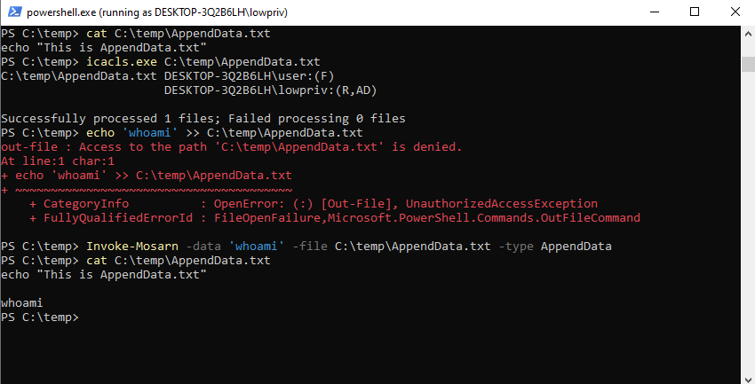
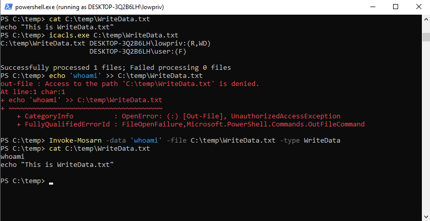

# Invoke-Mosarn

## Getting started

When enumerating file permissons on Windows systems you sometimes come by the `AppendData`
or `WriteData` NTFS ACL.

A regular `echo "snus" >> file.txt` requires `Write` permissions on the file, and `AppendData` or `WriteData` will not be sufficient for `echo` actions. 

`Invoke-Mosarn` solves this by using the C# `System.IO StreamWriter` constructor to utilize 
`FileSystemRights` class and match the appropriate permission, to successfully 
modify the selected file.

## Examples

```
iex (new-object net.webclient).downloadstring("https://raw.githubusercontent.com/viksafe/Invoke-Mosarn/main/Invoke-Mosarn.ps1")
```




